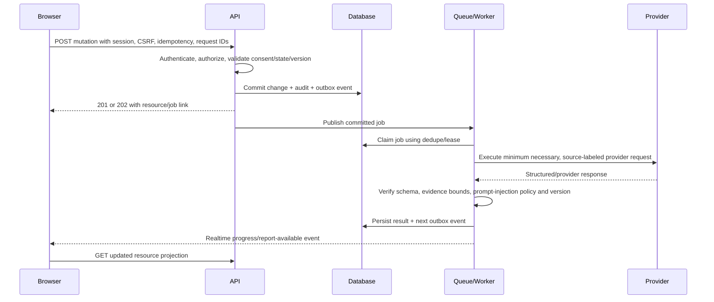

# Verity API Design

| Document control | Detail |
| --- | --- |
| Status | Proposed API contract |
| Style | Versioned REST commands/queries plus authenticated WebSocket session events |
| Base path | /v1 |
| Related documents | [Architecture](Architecture.md), [Database](Database.md) |

## 1. API design principles

The API is the sole product boundary for browser, realtime, worker, and future client interactions. It owns authorization, consent checks, validation, lifecycle transitions, idempotency, and audit creation. It never exposes direct database access, provider keys, raw storage credentials, or a generic prompt endpoint.

| Principle | Contract decision |
| --- | --- |
| Resource-oriented REST | Stable resources use plural nouns; commands that change a state machine use explicit action paths such as start, pause, approve, and revoke. |
| One public version | All browser endpoints begin with /v1. Breaking changes create /v2 only after a documented deprecation window; additive changes remain backward-compatible. |
| Async where work is slow | Media processing, document parsing, blueprint generation, evaluation, export, deletion, and re-evaluation return 202 with a job/status resource rather than holding an HTTP connection. |
| Clear ownership | Candidate resources are private to their owner. Share access is a separate capability flow; support/admin access is role- and purpose-gated. |
| Retry safety | Every externally retryable mutation accepts an Idempotency-Key. The same actor/key/route/request fingerprint returns the original result. |
| Evidence-safe output | A report API returns claim-to-criterion-to-evidence links and confidence. It does not return a hiring prediction, hidden model reasoning, or unsupported score. |
| Data minimization | The API returns the smallest projection required by the screen. Raw audio and original files are accessed only through separately authorized, expiring URLs. |

## 2. Cross-cutting contract conventions

### Transport and format

- HTTPS is required for all HTTP endpoints; secure WSS is required for realtime.
- Request and response bodies use JSON with UTF-8 unless an endpoint explicitly creates a signed object-storage transfer.
- Identifiers are opaque UUIDs. Timestamps use ISO 8601 UTC. Durations are integer milliseconds. Page cursors are opaque.
- List responses have data, page metadata, and next_cursor. The server enforces a bounded page size.
- Clients may send X-Request-ID for end-to-end correlation; the API generates one if absent and returns it in every response.
- Every mutation accepts Idempotency-Key. Reusing a key with a different request payload returns a conflict.
- Unsafe cookie-authenticated requests require X-CSRF-Token and an allowed Origin. Browser CORS is limited to Verity-owned origins.
- Capability responses, exports, and source/media access grants are `Cache-Control: no-store`. Share-token paths set `Referrer-Policy: no-referrer`, are excluded from analytics, and tokens are redacted before logs or traces are emitted.

### Response and error semantics

| Status | Meaning | Client behavior |
| --- | --- | --- |
| 200 / 201 | Synchronous read or command succeeded | Render returned resource projection. |
| 202 | Work accepted and is asynchronous | Poll the linked job/status resource or subscribe to realtime progress. |
| 204 | Successful action has no representation | Update local state only after matching resource/event confirmation. |
| 400 / 422 | Malformed or semantically invalid input | Show field-safe validation feedback; do not retry unchanged. |
| 401 | Missing, expired, or invalid authentication | Attempt one refresh flow, then return to sign-in. |
| 403 | Authenticated actor lacks role, ownership, consent, or scope | Do not reveal whether another tenant’s resource exists. |
| 404 | Resource not found within caller scope | Treat as unavailable; do not probe IDs. |
| 409 | State transition, idempotency, or version conflict | Refresh resource and resolve according to returned conflict code. |
| 410 | Expired/revoked share capability or purged resource | Show a safe unavailable state. |
| 413 / 415 | Upload too large or unsupported media type | Ask for compliant input; do not stream through the API as a fallback. |
| 429 | Rate, quota, or concurrent-session limit | Honor Retry-After and show product-appropriate limit state. |
| 502 / 503 / 504 | Dependency/provider failure or maintenance | Preserve local work and retry only under returned guidance; status remains durable. |

An error response contains a stable machine code, a user-safe message, field errors where applicable, a retryability indicator, and the request ID. It never includes stack traces, provider prompt/response bodies, storage keys, session secrets, or another user’s identifier.

### Concurrency controls

Mutable resources expose a version or ETag. PATCH/action requests include the last observed version where a stale update could overwrite a candidate decision, such as transcript corrections, blueprint approval, share-link change, or consent withdrawal. A 409 returns the current state/projection appropriate to the caller so the UI can reconcile deliberately.

## 3. Authentication and authorization

### Authentication flow

```mermaid
sequenceDiagram
    participant C as Candidate browser
    participant W as Next.js app
    participant A as Verity API
    participant G as Google OAuth
    participant D as PostgreSQL

    C->>W: Selects Continue with Google
    W->>A: GET /v1/auth/google/start
    A->>A: Create state, nonce, PKCE verifier; bind to browser
    A-->>C: Redirect to Google authorization
    C->>G: Authenticate and grant identity scope
    G-->>A: GET callback with authorization code and state
    A->>A: Verify state/nonce; exchange code using PKCE
    A->>D: Create/link identity and rotating auth session
    A-->>C: Set Secure HttpOnly access JWT and refresh-session cookies
    C->>A: GET /v1/auth/me plus CSRF-safe requests
    A-->>C: Candidate identity and permitted capabilities
```

Google OAuth uses authorization-code flow with PKCE and a narrowly scoped identity request. Verity immediately establishes its own session: a short-lived signed JWT access token and an opaque, rotating refresh session. Both are Secure, HttpOnly, SameSite cookies issued by the API host; neither is stored in local storage. The refresh token is stored only as a hash in PostgreSQL and can be revoked per device/session.

| Actor | Permitted scope |
| --- | --- |
| Unauthenticated visitor | Public health/status, OAuth initiation/callback, and a valid share-link projection. |
| Candidate | Only resources owned by their user ID, their own consent/privacy settings, and their own share links. |
| Share recipient | A redacted projection specified by one valid, unexpired, non-revoked token; no account/session history or default media access. |
| Support | Time-bound, purpose-recorded support operations; no bulk browsing and no raw audio by default. |
| Admin | Explicit administrative/rubric/operations actions with MFA, least privilege, and audit. |
| Service/worker | Internal service credential with narrow job/telemetry permissions; never a candidate session. |

### Auth endpoints

| Method and path | Purpose | Result |
| --- | --- | --- |
| GET /v1/auth/google/start | Initiate Google OAuth after browser state/PKCE setup | Redirect to Google. |
| GET /v1/auth/google/callback | Receive and verify OAuth callback | Creates/links Verity identity, sets session cookies, redirects to a safe app route. |
| GET /v1/auth/csrf | Issue/refresh a session-bound masked CSRF token | 200; the browser sends it only in the `X-CSRF-Token` header for unsafe requests. |
| POST /v1/auth/refresh | Rotate an active refresh session | New access/refresh cookies; revokes prior rotation token. |
| POST /v1/auth/logout | Revoke current session and clear cookies | 204 and audit event. |
| POST /v1/auth/logout-all | Revoke all candidate sessions | 202 if broad session cleanup is queued. |
| GET /v1/auth/me | Read current candidate identity, role, feature capabilities | Minimal identity/session projection. |

## 4. Resource map

### 4.1 Profile, consent, and privacy

| Method and path | Purpose | Async/result |
| --- | --- | --- |
| GET /v1/me/profile | Read candidate profile and editable preferences | 200 |
| PATCH /v1/me/profile | Update language, accessibility, or feedback directness | 200 with version check |
| GET /v1/me/consents | Read current and historical consent records | 200 |
| POST /v1/me/consents | Grant explicit, versioned consent for a declared purpose/scope | 201 |
| POST /v1/me/consents/{consent_id}/withdraw | Withdraw eligible consent and trigger dependent restrictions | 202 when purge/restriction work is required |
| POST /v1/me/exports | Request a candidate data export | 202 with data-subject-request resource |
| POST /v1/me/deletion-requests | Request account/data deletion | 202 with access immediately revoked where applicable |
| GET /v1/me/data-requests/{request_id} | Read export/deletion progress, exceptions, and expiry | 200 |
| POST /v1/me/data-requests/{request_id}/download-access-grants | Create one short-lived download grant for a completed export | 201; never returns an object key |
| GET /v1/me/audit-events | Read candidate-visible lifecycle/access audit events | 200 paginated |

Consent requests name a single purpose, data class, policy version, and scope. The API rejects ambiguous blanket consent. Withdrawal immediately prevents new processing for that purpose; already queued work checks consent again before execution.

### 4.2 Documents and candidate facts

| Method and path | Purpose | Async/result |
| --- | --- | --- |
| POST /v1/documents/upload-intents | Validate consent/quota/type, expected size, and checksum; create one signed upload intent | 201 with document/version ID and restricted upload URL |
| POST /v1/documents/{document_id}/versions/{version_id}/complete | Confirm upload checksum/size and request scan/parse | 202 with job; server re-verifies object ownership and detected type |
| GET /v1/documents | List candidate-owned document metadata | 200 paginated |
| GET /v1/documents/{document_id} | Read safe metadata, versions, processing state, retention | 200 |
| GET /v1/documents/{document_id}/segments | Read citable extracted segments after authorization | 200 paginated |
| POST /v1/documents/{document_id}/reprocess | Retry permitted parse path after a recoverable failure | 202 |
| DELETE /v1/documents/{document_id} | Revoke use and initiate purge of a source document | 202 |
| GET /v1/profile-facts | List approved/pending extracted facts with sources | 200 |
| POST /v1/profile-facts | Add a candidate-authored fact | 201 |
| PATCH /v1/profile-facts/{fact_id} | Correct, approve, or reject a fact | 200 with version check |
| DELETE /v1/profile-facts/{fact_id} | Remove a fact from future personalization | 202 if dependent reprocessing is needed |

The browser uploads directly to private storage using a short-lived single-object grant. It sends only completion metadata to the API; source bytes never traverse ordinary API logs. A document remains unavailable to AI planning until malware scan, extraction, and consent checks pass. Deletion immediately removes the document from future planning; report/blueprint views replace historical citations with a deletion tombstone rather than preserving source text outside the requested lifecycle.

### 4.3 Job targets, blueprints, and rubrics

| Method and path | Purpose | Async/result |
| --- | --- | --- |
| GET, POST /v1/job-targets | List or create a role target | 200 / 201 |
| GET, PATCH, DELETE /v1/job-targets/{target_id} | Read, edit, or retire a candidate target | 200 / 202 |
| POST /v1/blueprints | Request a grounded blueprint for a target and selected sources | 202 with job |
| GET /v1/blueprints | List candidate blueprints | 200 |
| GET /v1/blueprints/{blueprint_id} | Read blueprint, citations, selected criteria, and state | 200 |
| PATCH /v1/blueprints/{blueprint_id} | Edit selected facts, topic exclusions, competence weights, or notes | 200 with version check |
| POST /v1/blueprints/{blueprint_id}/approve | Approve exact version for session use | 200; immutable approval record |
| POST /v1/blueprints/{blueprint_id}/regenerate | Generate a successor from changed approved sources | 202 |
| GET /v1/rubrics | Read public candidate-safe rubric catalog by track/version | 200 |
| GET /v1/rubric-versions/{version_id} | Read descriptors and prohibited-inference policy | 200 |

Blueprint generation returns document-segment citations and labels inferences. The API will not approve a blueprint containing unresolved pending facts, absent required consent, or unsupported citations.

### 4.4 Interview sessions and answer capture

| Method and path | Purpose | Async/result |
| --- | --- | --- |
| GET, POST /v1/sessions | List sessions or create a draft from an approved blueprint | 200 / 201 |
| GET /v1/sessions/{session_id} | Read session state, timer, active turn, and safe progress | 200 |
| POST /v1/sessions/{session_id}/start | Start a ready session and issue the first turn | 200 |
| POST /v1/sessions/{session_id}/pause | Pause timer/turn processing | 200 |
| POST /v1/sessions/{session_id}/resume | Resume an eligible paused session | 200 |
| POST /v1/sessions/{session_id}/finish | Finalize input and schedule report evaluation | 202 |
| POST /v1/sessions/{session_id}/cancel | Cancel an unused/eligible session without deleting retained data | 200 |
| DELETE /v1/sessions/{session_id} | Revoke session/share access and create a scoped deletion request | 202 with data-request status link |
| GET /v1/sessions/{session_id}/turns | Read ordered prompts and answer states | 200 |
| PUT /v1/sessions/{session_id}/turns/{turn_id}/text-answer | Save/replace an in-progress typed answer | 200 with version check |
| POST /v1/sessions/{session_id}/turns/{turn_id}/media-upload-intents | Create scoped upload grants for voice chunks/final media | 201 |
| POST /v1/sessions/{session_id}/turns/{turn_id}/media-complete | Submit the ordered, checksum-validated upload manifest; finalize answer and enqueue transcription | 202 |
| GET /v1/sessions/{session_id}/transcript | Read the current selected transcript version and segment metadata | 200 |
| POST /v1/sessions/{session_id}/transcript-corrections | Create a candidate-corrected transcript successor | 202 when re-evaluation is selected |
| POST /v1/media-artifacts/{media_id}/access-grants | Create a single-purpose, short-lived owner-only playback/download grant | 201 with audit; unavailable to share recipients by default |
| DELETE /v1/media-artifacts/{media_id} | Revoke playback and initiate raw-media purge without implying transcript/report deletion | 202 |

Only the server may issue the next interviewer turn. A client provides a typed answer or announces that a signed audio chunk/final upload is ready; it cannot select a rubric, fabricate a server event, or mark a turn evaluated. The finalization request references only server-issued upload IDs, supplies the ordered chunk manifest and checksum, and is rejected on duplicate/gap/out-of-turn sequences. Connection loss pauses or degrades the session according to the persisted state machine rather than silently discarding work.

### 4.5 Reports, evidence, feedback, and learning

| Method and path | Purpose | Async/result |
| --- | --- | --- |
| GET /v1/sessions/{session_id}/report | Read active report status or the published report projection | 200 / 202 |
| GET /v1/reports/{report_id} | Read report summary, dimensions, confidence, and version provenance | 200 |
| GET /v1/reports/{report_id}/claims | Read paginated evidence-backed claims | 200 |
| GET /v1/reports/{report_id}/claims/{claim_id} | Read one claim, criterion, cited spans, and rationale | 200 |
| POST /v1/reports/{report_id}/claims/{claim_id}/challenges | Mark helpful, incorrect, or needs-context; attach bounded context | 201 |
| POST /v1/reports/{report_id}/re-evaluations | Request limited re-evaluation after correction/challenge | 202 with job; subject to quota/policy |
| GET /v1/drills | List drills by state/due date/criterion | 200 |
| POST /v1/drills/{drill_id}/complete | Record candidate completion/self-reflection | 201 |
| GET /v1/retest-recommendations | List comparable re-test recommendations | 200 |
| POST /v1/retest-recommendations/{id}/dismiss | Record a candidate decline with optional reason | 200 |
| GET /v1/progress | Read confidence-aware, comparable criterion trends | 200 |

Reports expose content, reasoning, structure, and delivery as distinct views. Delivery observations do not modify the content score. A trend response must return comparability/evidence metadata and uses “not assessed,” “insufficient evidence,” or “declined” rather than rendering missing data as poor performance.

### 4.6 Sharing, jobs, and privileged operations

| Method and path | Purpose | Async/result |
| --- | --- | --- |
| POST /v1/reports/{report_id}/share-links | Create a scoped, redacted, expiring share link | 201 |
| GET /v1/share-links | List candidate-owned links | 200 |
| PATCH /v1/share-links/{link_id} | Reduce scope/expiry or change permitted redaction profile | 200 |
| POST /v1/share-links/{link_id}/revoke | Invalidate a link immediately | 204 |
| GET /v1/shared/{token} | Read one authorized redacted share projection | 200 or one indistinguishable 410 capability-unavailable response |
| GET /v1/jobs/{job_id} | Read a caller-authorized async job status/progress/result reference | 200 |
| GET /v1/admin/rubric-releases | Admin-only published/pending rubric release status | 200 |
| POST /v1/admin/rubric-releases/{id}/publish | Admin-only gated rubric release | 200 with audit |
| GET /v1/admin/operations/health | Role-limited operational health projection | 200 |

Admin endpoints are intentionally few and never form a bulk candidate-data API. Every privileged operation includes a declared support/operational purpose, actor identity, target scope, correlation ID, and audit outcome.

## 5. Realtime session protocol

One authenticated socket is opened at WSS /v1/realtime/sessions/{session_id}. The socket uses the API session cookie, exact origin validation, session ownership check, connection heartbeat, and a last-event cursor for replay. It never accepts an access token, share token, or storage URL in the query string. It is a notification/coordination channel; all durable commands still pass through the same application service and can be reconciled through REST.

| Direction | Event | Required content | Purpose |
| --- | --- | --- | --- |
| Server → client | session.snapshot | state, active turn, timer anchor, last event ID | Reconnect-safe baseline state. |
| Server → client | turn.issued | turn ID, prompt, allowed answer mode, timing | Present exactly one server-issued interviewer question. |
| Client → server | answer.chunk-ready | turn ID, server-issued upload ID, sequence number, checksum | Announces an already authorized audio chunk; no provider key, storage URL, or arbitrary object key accepted. |
| Server → client | transcript.provisional | transcript version, segment IDs, timing, provisional flag | Show machine-generated in-progress captioning. |
| Server → client | transcript.finalized | transcript version, correction eligibility | Update final transcript state. |
| Server → client | session.state-changed | new state, reason, version | Synchronize pause, resume, degraded, finish, or cancellation. |
| Server → client | job.progress | job ID, phase, safe progress/message | Notify blueprint/transcript/evaluation/export progression. |
| Server → client | report.available | report ID, evaluation version, publication state | Invite client to fetch normal REST report projection. |
| Server → client | system.degraded | capability, fallback, retry guidance | Make a provider outage explicit without exposing internals. |
| Either | heartbeat | connection/event cursor | Detect stale connection; no candidate content. |

The realtime gateway rejects unexpected event types, out-of-order chunks, oversized messages, missing consent, stale session versions, and cross-tenant IDs. It rate-limits events separately from REST. After reconnect, the client first receives a snapshot and then events after its acknowledged cursor; it never relies solely on browser memory for interview state. A second browser tab may observe a session, but its answer commands must satisfy the same turn version and idempotency rules as the active tab.

## 6. Request and job lifecycle



Job states are queued, running, retry_scheduled, succeeded, failed, cancelled, and blocked. A failed provider call is not automatically a user-facing failure: the job may retry within bounded policy, wait for a candidate correction, or enter degraded state with a text/later-processing fallback. The job resource reveals only safe status, retry timing, and result links to its owner.

## 7. Rate limiting, quotas, and abuse boundaries

Rate limits are enforced at IP, account, route, concurrent-session, and provider-budget levels. OAuth initiation, share-token lookup, upload-intent creation, WebSocket events, and expensive evaluation/re-evaluation each have separate limits. The response distinguishes a short retryable limit from an account usage budget and includes a safe next action. Share capability lookups are aggressively rate-limited and return the same safe unavailable response for malformed, expired, or revoked tokens.

The API prevents live-interview copilot behavior through product scope and endpoint design: it has no stealth mode, ambient microphone endpoint, live-answer suggestion endpoint, browser extension API, or real-employer integration. Audio/session routes require a created practice session with visible state, consent, and retained audit lineage.

## 8. Compatibility, documentation, and test policy

FastAPI publishes the OpenAPI description for REST endpoints. The monorepo generates a typed web client from that source and runs consumer/provider contract tests in CI. WebSocket events have separately versioned schemas and replay tests. Additive response fields are tolerated; renamed/removed fields or changed semantics require a new API version or documented migration period.

Every endpoint has authorization, tenant-isolation, idempotency, validation, and audit tests as appropriate. High-risk endpoints additionally require security tests: signed upload scope, share token expiry/revocation, consent withdrawal racing queued work, transcript correction lineage, report evidence gating, export/deletion, and privileged-access purpose logging.

## 9. API acceptance checklist

- A browser can complete onboarding, blueprint approval, a text/voice practice session, report exploration, feedback challenge, drill completion, share, export, and deletion through documented resources.
- Every asynchronous command returns a durable, authorized status path and is safe to retry.
- The WebSocket supplements REST but cannot bypass session state, ownership, consent, or audit controls.
- Authentication uses OAuth, short-lived JWT access, server-revocable rotating sessions, Secure HttpOnly cookies, and CSRF/origin protections.
- No public contract exposes raw provider credentials, storage credentials, hidden chain-of-thought, unsupported feedback, or a live-interview assistance capability.
