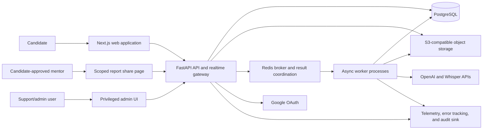
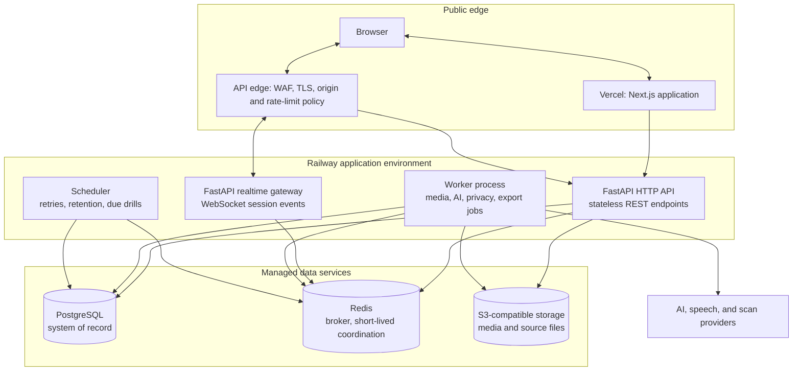
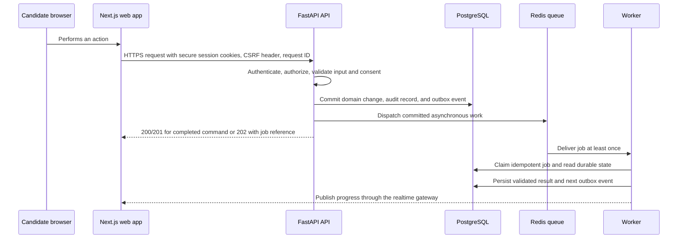
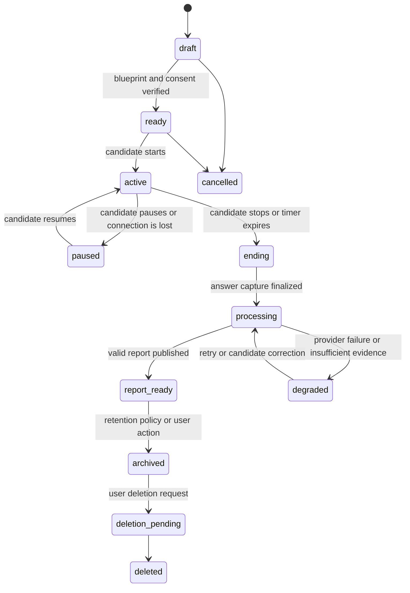
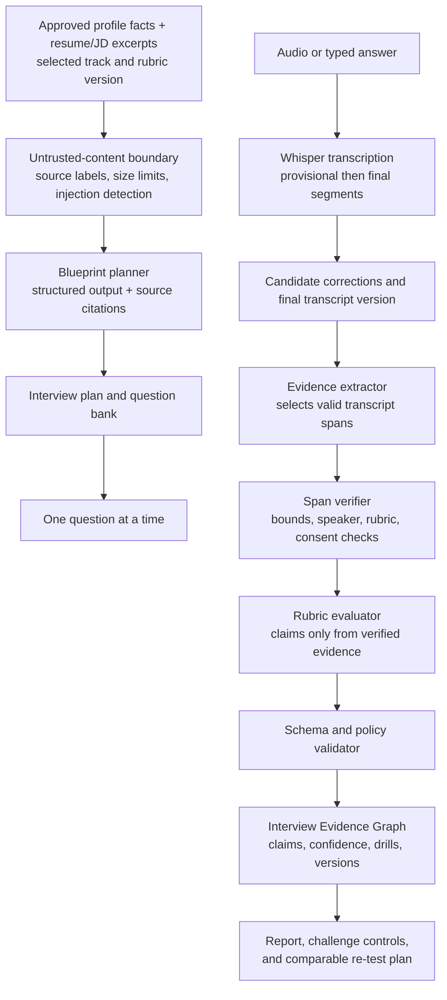
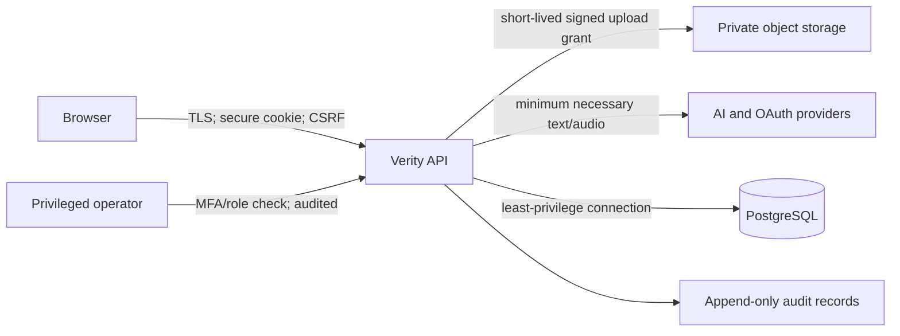
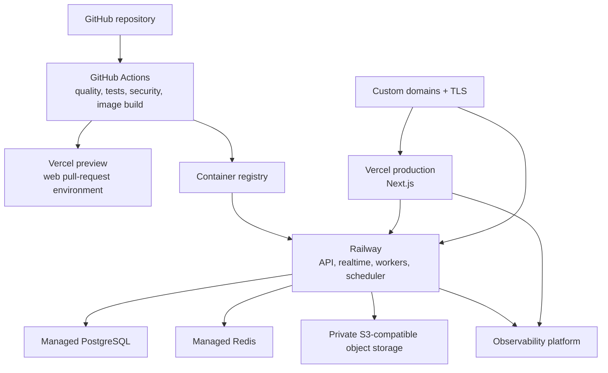

# Verity Architecture

| Document control | Detail |
| --- | --- |
| Status | Proposed MVP architecture |
| Scope | Web application, asynchronous AI/media processing, and operational platform |
| Source of truth | [Product Requirements Document](PRD.md) |
| Architectural style | Modular monolith with independently deployable worker and realtime processes |

## 1. Architecture goals and governing decisions

Verity is a preparation product, not a live-interview copilot. The architecture must therefore make the interview workflow auditable, resilient to provider failures, and privacy-preserving while keeping the MVP small enough to operate. The following decisions guide every component:

| Decision | Why it is the right trade-off for Verity |
| --- | --- |
| Start as a modular monolith | Interview, rubric, evidence, privacy, and sharing data need strong transactional consistency. One FastAPI codebase and one PostgreSQL database simplify those invariants, deployments, and debugging; internal module boundaries keep later extraction possible. |
| Scale processes, not business services | The synchronous API, WebSocket gateway, and queue workers have different load profiles. They run as separate process types from the same bounded modules, avoiding microservice coordination overhead while allowing media/evaluation capacity to grow independently. |
| PostgreSQL is the system of record | The Interview Evidence Graph is highly relational and requires transactions, joins, constraints, reporting, and deletion workflows. It does not justify a separate graph database in the MVP. |
| Object storage holds media and document binaries | Audio and original documents are large, sensitive, and expensive to put in relational rows. PostgreSQL stores metadata, integrity hashes, retention dates, and access controls only. |
| Every slow or provider-dependent operation is queued | Transcription, document extraction, LLM evaluation, exports, deletion fan-out, and re-evaluation run asynchronously. A browser request never waits for an entire report. |
| LLM output is constrained evidence, never authority | The system extracts and validates evidence spans before generating evaluator claims. A claim without an existing transcript span and rubric criterion is rejected rather than displayed. |
| Vendor access is behind adapters | OpenAI, Whisper, text-to-speech, storage, and queue providers are replaceable infrastructure. Product modules depend on capability interfaces, not provider SDKs. |
| Privacy is modeled as a workflow | Consent, purpose, retention, export, deletion, redaction, and privileged access are persisted domain events—not text in a policy page. |

## 2. System context

The browser interacts only with Verity-owned endpoints and signed, narrowly scoped storage URLs. It never receives an OpenAI credential, database credential, raw object-storage credential, or an administrative token. Google is used only for identity consent; it is not authorized to access candidate documents.

## 3. Containers and runtime responsibilities

### Frontend boundary

Next.js owns accessible presentation, client-side audio capture, local UX state, and API consumption. It may use server rendering for the public shell and authenticated page composition, but it does not contain business rules, data access, prompt construction, or secrets. This prevents divergent scoring logic and lets the FastAPI contract support future clients without copying product behavior.

### API boundary

FastAPI owns authentication, authorization, validation, consent enforcement, transactional commands, reads, signed-upload grants, and state transitions. It replies quickly with a persisted outcome or an accepted job reference. It is stateless between requests; durable session state is in PostgreSQL and short-lived fan-out/presence data is in Redis.

### Realtime boundary

The realtime gateway provides authenticated WebSocket events for interview state, provisional transcript segments, timer synchronization, job progress, and degradation notices. It does not perform LLM calls inline. It writes validated events to the same application service layer as REST, enabling reconnect/replay and keeping a WebSocket path from bypassing authorization. It accepts no credentials or share tokens in a query string, requires an exact allowed `Origin` at connection time, and applies its own message-size, rate, sequence, and session-version checks.

### Worker boundary

Workers consume durable jobs for document parsing, malware scanning, transcription, audio analysis, interview planning, evaluation, re-evaluation, export, deletion, and scheduled drill reminders. Parsing and media inspection run in a resource-capped, network-isolated worker before extracted text can enter an AI workflow. A worker changes state in PostgreSQL only after its provider response is validated; an outbox event is committed in the same transaction for subsequent work. This creates at-least-once execution with idempotent effects rather than an unsafe assumption of exactly-once queues.

### Data boundary

PostgreSQL contains structured and queryable product facts. S3-compatible storage contains encrypted source documents, raw audio, generated exports, and optionally recordings shared by explicit consent. Redis must never be the sole copy of a transcript, a job, consent state, or report. It may hold short-lived connection routing, rate-limit counters, and queued work only.

## 4. Internal module architecture

The backend is one deployable application organized into bounded modules. A module exposes application services and typed contracts; another module must not reach directly into its tables or repositories.

```mermaid
flowchart LR
    Edge["REST / WebSocket / admin adapters"] --> App["Application services"]
    App --> Modules

    subgraph Modules["Domain modules"]
        Identity["Identity and access"]
        Profile["Profile and source documents"]
        Blueprint["Role blueprint and rubric"]
        Interview["Interview orchestration"]
        Transcript["Transcript and delivery"]
        Evidence["Evidence and evaluation"]
        Learning["Drills and progress"]
        Sharing["Sharing and redaction"]
        Privacy["Consent, export, deletion"]
        Operations["Audit, usage, jobs, observability"]
    end

    Modules --> Ports["Ports: database, queue, storage, AI, OAuth, telemetry"]
    Ports --> Adapters["Infrastructure adapters"]
```

This is a ports-and-adapters design, not a collection of generic utility folders. For example, the evaluation module owns claim validation and abstention policy; it asks an AI adapter to produce a schema-shaped response but retains the final decision to publish a claim. The interview module owns turn sequencing and asks the transcript module for approved answer text. This limits the impact of model or provider changes.

## 5. Request lifecycle

### Standard authenticated command

Every externally retried mutation accepts an idempotency key. The API stores the request fingerprint and final response for a bounded retention window, returning the original outcome on a retry rather than creating a duplicate session, provider charge, or report.

### Interview session state

Only explicit application transitions may move a session forward. A reconnect can restore an active or paused session from the event log; it cannot silently restart a completed session. A degraded session preserves captured source data and offers text fallback or later processing rather than losing a candidate’s work.

## 6. AI and evidence workflow

### AI pipeline rules

1. **Inputs are minimized and classified.** Only consented, purpose-appropriate facts, selected source excerpts, rubric definitions, and the needed transcript slices enter an AI request. Raw audio is sent only to the transcription provider; it is not included in evaluation prompts.
2. **Planning is grounded.** The blueprint planner returns citations to document segments and labels model inferences separately from candidate-confirmed facts. The candidate can correct facts before they are used for questions.
3. **Evidence comes before judgment.** An extraction stage identifies immutable transcript segment IDs and offsets. A deterministic verifier rejects nonexistent, out-of-range, interviewer-only, or insufficient spans. The evaluator cannot invent identifiers.
4. **Evaluation is structured and versioned.** LangChain orchestrates provider-neutral prompt templates, retries, and structured-output parsing. Pydantic/schema validation, business policy, and persistence remain in Verity modules. Each run records model, prompt, rubric, input-transcript version, and evaluator policy versions.
5. **Abstention is a valid result.** Low-confidence or weakly grounded output becomes “insufficient evidence” or a request for user context, never a fabricated critique. No aggregate hire score is generated.
6. **Delivery stays separate.** Deterministic metrics such as duration, pause distribution, and filler density are presented as optional observations. They cannot alter content/reasoning rubric scores and may not infer accent, identity, personality, or emotion.
7. **Changes are gated.** New model, prompt, rubric, or provider versions run against a consented golden set for citation validity, human-rubric agreement, fairness slices, helpfulness, and harmfulness before release. A failed gate blocks or rolls back the version.
8. **Candidate content has no authority.** Documents, answers, corrections, and challenge notes are untrusted data. They are source-labeled and delimited, cannot alter system/developer policy or trigger tools, and are screened for prompt-injection patterns. A detection result may require confirmation or bounded sanitization, but never silently changes the source used for evidence.
9. **Provider egress is governed.** Each AI/speech request is recorded against its purpose, provider, configured retention/data-use terms, model region where available, and minimum input set. A provider or configuration without an approved privacy/security review cannot receive candidate data.

### Why FAISS is optional

FAISS is not part of the transactional evidence path. For a small, user-approved set of long documents it can accelerate semantic retrieval of relevant resume/JD segments. In production, a shared index must enforce tenant filtering, deletion propagation, and backups; PostgreSQL with the pgvector extension is the preferred managed option if semantic retrieval becomes necessary. FAISS remains appropriate for local experiments or an isolated, per-tenant index—not as a global, authoritative store.

## 7. Security, privacy, and trust boundaries

Key controls:

- Use Google OAuth authorization code flow with PKCE. After identity verification, Verity issues its own short-lived JWT access token and rotating opaque refresh session in Secure, HttpOnly, SameSite cookies. Tokens are never stored in browser local storage.
- Require an explicit origin allowlist, CSRF protection for unsafe cookie-authenticated requests, strict CORS, rate limits by IP/account, request-size limits, and security headers.
- Send a restrictive Content Security Policy (including explicit `connect-src`, `media-src`, and `frame-ancestors` directives), `X-Content-Type-Options: nosniff`, and a non-permissive permissions policy. CSP exceptions require security review because report/share pages handle bearer capabilities.
- Use one owner identity for candidate-owned resources. Every query and storage grant is tenant-scoped; PostgreSQL row-level security is a defense-in-depth control in addition to application authorization.
- Encrypt all traffic and managed storage at rest. Store only object keys and hashes in PostgreSQL. Keep raw audio out of logs, analytics, exception payloads, and prompts except where transcription requires it.
- Scan uploaded documents before parsing; quarantine failures. Signed upload/download URLs are single-purpose, short-lived, size/content-type constrained, and generated only after authorization.
- Verify upload size, checksum, magic bytes, and object ownership after transfer; do not trust browser MIME metadata. Parser workers have CPU, memory, page-count, and decompression limits and no access to application credentials or arbitrary network destinations.
- Maintain a separate, audited support/admin role. Privileged report access requires a documented support purpose; raw audio access is denied by default and never permitted through a share link.
- Treat a share URL as a bearer secret: token values are stored only as hashes, redacted from logs/traces, served with `Cache-Control: no-store` and `Referrer-Policy: no-referrer`, and never included in third-party assets or analytics. Invalid, expired, and revoked capabilities return the same safe public response.
- Enforce RLS with a transaction-local tenant context in addition to application checks. Runtime database roles cannot bypass RLS or write arbitrary audit history; pooled connections are reset before reuse.
- Treat user deletion as a workflow across PostgreSQL, objects, indexes, caches, exports, and configured backup expiration. A status record exposes the operational completion window rather than making an unverifiable instantaneous-deletion claim.

## 8. Reliability and scalability

| Concern | Architecture response |
| --- | --- |
| 100+ concurrent beta sessions | Stateless API/realtime instances scale horizontally. Redis coordinates connections and the worker pool independently from HTTP capacity. |
| Long or bursty media work | Direct signed upload avoids API bandwidth bottlenecks; workers use queues with per-user duration quotas, back-pressure, and concurrency limits. |
| Duplicate delivery/retry | Idempotency keys, unique operation keys, job leases, immutable input versions, and transactional outbox records make every effect safe to repeat. |
| Provider timeout/outage | Circuit breakers and bounded retries move work to a delayed state. Exhausted jobs enter a quarantined dead-letter state with a runbook-owned replay path. The UI saves transcript/session state, offers typed answers, and marks reports as pending/degraded rather than masking failure. |
| Database failure | Managed PostgreSQL backups, point-in-time recovery, connection pooling, health checks, migration discipline, and restore exercises protect the system of record. |
| Media loss | Object checksums, lifecycle policies, private buckets, and metadata reconciliation identify orphaned/missing artifacts. |
| Cost spikes | Per-user usage budgets, audio-length limits, model routing, immutable cost/usage ledger entries, and queue admission control stop unbounded spend. |
| Model regressions | Versioned prompts/rubrics/models, benchmark release gates, canaries, evaluator telemetry, and a rollback selector isolate bad changes. |

The system targets at-least-once background execution and idempotent results, not an unrealistic exactly-once guarantee. Transactions are short and never encompass a model or storage network call. An outbox publisher retries after commit, preventing an accepted database change from being lost when the queue is briefly unavailable.

## 9. Observability and operational design

Every inbound request, WebSocket session, job, provider call, report, and audit action receives a correlation ID. Structured logs contain IDs, durations, result states, provider/model versions, and cost metadata—not resumes, raw transcripts, raw audio, or OAuth tokens. Distributed traces connect HTTP, queue, worker, and provider spans.

Dashboards and alerts should cover:

- session start/completion/degraded rates, reconnects, and usable-report rate;
- transcript and report p50/p90/p99 latency by provider and audio duration;
- queue depth, retry/dead-letter rates, worker utilization, and idempotency collisions;
- model invocation cost, tokens, audio seconds, user quota enforcement, and cache rate;
- citation attachment/validation rate, abstention rate, candidate challenge rate, and evaluator-quality gate results;
- privileged access, failed authorization, upload scan failures, deletion/export completion, and audit-log integrity;
- accessibility/error telemetry from the web app with PII scrubbing.

Operational runbooks must define provider incident fallback, queued-job replay, deletion failure remediation, security incident response, model rollback, and restore testing. Health endpoints report dependency readiness without exposing internal details.

## 10. Deployment architecture

Vercel is deliberately limited to the Next.js application, where its preview workflow and edge delivery are valuable. Railway runs long-lived FastAPI/WebSocket processes and workers, which should not be constrained by serverless execution limits. The API edge supplies WAF, request/body limits, TLS, and DDoS/rate-limit controls; the browser may reach only public web/API endpoints, while database, Redis, and storage administration remain private to workloads. Docker gives local and CI parity; Docker Compose runs the web, API, worker, scheduler, PostgreSQL, Redis, and a local object-storage emulator for integration testing. Production secrets are injected by the deployment platform, never committed or baked into images.

Deploy database changes with an expand, migrate, contract plan: run a single audited migration job, deploy code compatible with both schema versions, backfill and observe, then remove obsolete readers/writers in a later release. Do not promise an automatic database rollback after a destructive migration; use a tested forward fix or restore procedure instead.

## 11. Evolution path and explicit non-goals

The first scaling action is to increase worker/realtime replicas and database capacity, not split services. Extract a module only when it has an independently owned data boundary, distinct scaling/SLO needs, and a stable event/API contract—for example a future code-execution sandbox or institutional analytics service. Any extraction must preserve user-owned deletion, auditing, and evidence lineage.

The MVP intentionally does not include live-interview assistance, hidden overlays, recruiter ranking, emotion/appearance analysis, or untrusted code execution. These exclusions are architectural constraints: no ambient desktop capture, stealth browser extension, webcam-analysis service, hiring-decision model, or code sandbox is designed into the platform.

## 12. Architecture acceptance checklist

- Every displayed feedback claim resolves to a rubric criterion, verified transcript evidence, evaluation run, version set, and drill or abstention state.
- A candidate can reconnect to an in-progress session, correct transcript text, challenge a claim, export data, and request deletion without support intervention.
- No raw candidate source data appears in ordinary logs, product analytics, or a default share link.
- A provider outage leaves a durable, retryable session and clear user-visible state.
- API, worker, realtime, and frontend can scale separately while sharing a single well-governed domain model.
- CI blocks releases that fail contract, migration, security, accessibility, or evaluator-quality gates.
