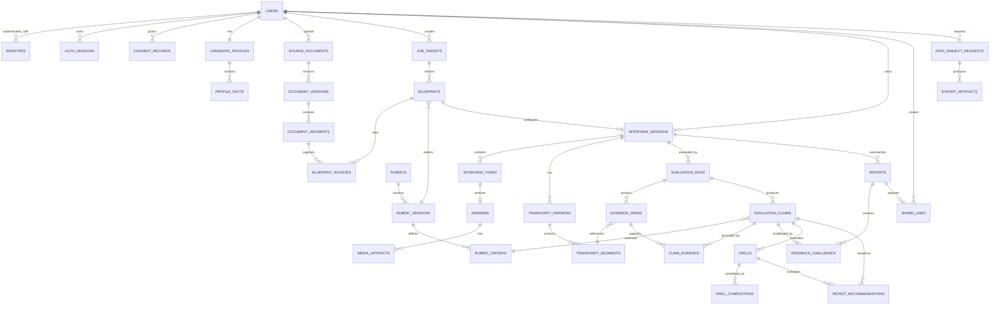
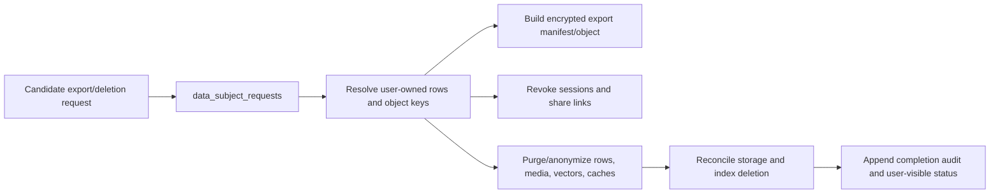

# Verity Database Design

| Document control | Detail |
| --- | --- |
| Status | Proposed relational data architecture |
| Primary store | PostgreSQL |
| Related documents | [Architecture](Architecture.md), [API](API.md) |

## 1. Data design principles

PostgreSQL is the durable source of truth for user-owned product state and the Interview Evidence Graph (IEG). It is not a dump of provider responses. Foreign keys, immutable version links, tenant ownership, and lifecycle states make every visible assessment traceable and deletable.

| Principle | Design consequence |
| --- | --- |
| Candidate ownership | Every candidate-owned root aggregate carries an owner user ID. Application authorization and PostgreSQL row-level security protect tenant reads and writes; the application/worker role does not have `BYPASSRLS`. |
| Evidence before evaluation | A claim cannot be shown unless it references verified transcript evidence and a rubric criterion, or is explicitly marked insufficient evidence. |
| History must be reproducible | Documents, transcripts, rubrics, prompts, evaluations, and reports are versioned. Corrections create a new version rather than changing past inputs. |
| Blobs are not rows | Source files, raw audio, and generated exports live in private object storage. PostgreSQL stores metadata, hash, retention date, and access state. |
| Privacy is operational | Consent, purpose, export, deletion, retention, redaction, and privileged access are persisted workflows with audit events. |
| AI calls are inspectable | Provider/model/prompt/schema/policy versions, validation result, cost, and correlation ID are recorded. Raw prompts/responses are minimized and access-controlled. |
| Retries are safe | Idempotency, outbox, job, and usage records make asynchronous work observable and safe to repeat. |

## 2. Modeling conventions

- Primary keys use UUIDv7 or another time-sortable UUID; public IDs are opaque.
- Timestamps are UTC with timezone. Append-only events have occurred_at; mutable entities have created_at and updated_at.
- States use managed enums or checked values, never arbitrary strings.
- Foreign keys default to restrictive deletion for evidence-bearing history. Account deletion is an audited purge/anonymization workflow, not an unsafe cascade.
- JSONB is for validated, versioned extensibility such as provider metadata or rubric snapshots. Fields used for authorization, retention, filters, reporting, or state changes are normalized.
- Usage/cost values use fixed-point numeric fields with explicit units. Audio timings use integer milliseconds.
- Object-storage keys are never authorization credentials; access comes through a newly authorized, short-lived signature.
- A connection-pool checkout sets the authenticated tenant and role context transaction-locally; check-in resets it. RLS policies are integration-tested so a reused connection cannot inherit another candidate's context.
- Intentional denormalizations such as `answers.session_id` must be protected by a composite foreign key or equivalent constraint. They exist for tenant-scoped query efficiency, never as a second editable source of truth.

## 3. Logical ER diagram

The graph is relational by design. A report claim follows report → evaluation run → claim → rubric criterion and claim-evidence → evidence span → immutable transcript segment/version → answer/turn/session. PostgreSQL constraints keep this traversal consistent without a separate graph database.

## 4. Tables by bounded context

### 4.1 Identity, access, and privacy

| Table | Key columns | Purpose and constraints |
| --- | --- | --- |
| users | id, email_lookup_hash, email_ciphertext, display_name, role, status | Root identity. A keyed normalized-email lookup hash is unique; the displayable email is encrypted. Roles are candidate, support, admin, or service and never inferred from OAuth. |
| identities | user_id, provider, provider_subject, linked_at | Google linkage; provider + subject is unique. Provider access tokens and duplicate provider-email copies are not retained without a declared feature need. |
| auth_sessions | user_id, token_family_id, refresh_token_hash, expires_at, revoked_at, rotated_from_id, compromise_detected_at | Server-revocable rotating sessions. Refresh-token reuse revokes the token family; only opaque token hashes are persisted. |
| consent_records | user_id, purpose, scope, policy_version, granted_at, withdrawn_at | Immutable consent history for source documents, audio, provider AI processing, sharing, and optional research. Current consent is derived. |
| data_subject_requests | user_id, request_type, resource_type, resource_id, state, requested_at, due_at, completed_at | Tracks export, full-account, and scoped resource deletion with every purge step. `resource_type`/`resource_id` are null for account-wide export/deletion requests. Completed export artifacts are resolved through their request ID. |
| export_artifacts | user_id, data_subject_request_id, object_key, checksum, expires_at, purge_state | Encrypted export metadata with a one-time, short retention lifecycle; object access is separately authorized. |
| retention_policies | data_class, policy_version, default_duration, legal_hold_rule | Actual artifacts store their calculated retention deadline so a later policy does not rewrite earlier commitments. |

### 4.2 Profile and source material

| Table | Key columns | Purpose and constraints |
| --- | --- | --- |
| candidate_profiles | user_id, preferred_language, accessibility_preferences, feedback_directness | One editable profile per candidate; sensitive preferences are purpose-limited. Target dates belong to a specific job target, not the global profile. |
| profile_facts | user_id, source_kind, fact_type, value, confidence, approval_state, source_segment_id | Candidate or model-extracted facts. Derived facts stay pending until approval and then may personalize sessions. |
| source_documents | user_id, document_type, title, current_version_id, state, retention_until | Resume, job description, or optional project source. |
| document_versions | document_id, object_key, content_hash, mime_type, scan_state, parse_state, extracted_at | Immutable upload metadata. Parsing begins only after scan and consent checks. |
| document_segments | document_version_id, ordinal, text, char_start, char_end, content_hash, redaction_state | Stable, citable extracted chunks; ordinal/range are unique per version. |
| media_artifacts | owner_user_id, answer_id, object_key, media_kind, checksum, duration_ms, retention_until, purge_state | Metadata for raw/normalized answer audio and generated media; only protected routes grant access. |

### 4.3 Role blueprint and rubric catalog

| Table | Key columns | Purpose and constraints |
| --- | --- | --- |
| job_targets | user_id, title, company_label, level, track, source_document_id, target_date | Candidate-selected target role; optional company label never authorizes leaked-question retrieval. |
| blueprints | user_id, job_target_id, rubric_version_id, state, inferred_summary, approved_at | Editable practice blueprint. It cannot start a session until candidate approval. |
| blueprint_sources | blueprint_id, document_segment_id, claim_kind, cited_text_hash | Makes every personalization claim traceable to a resume/JD segment. |
| blueprint_competencies | blueprint_id, rubric_criterion_id, importance_weight, include_state, user_note | Selected observable criteria; exclusion is enforced by question/evaluation workflows. |
| rubrics | slug, track, owner_type, status | Stable identity for behavioral, system-design, coding-reasoning, and future ML/AI rubrics. |
| rubric_versions | rubric_id, semantic_version, state, effective_at, prohibited_inferences | Published versions are immutable. |
| rubric_criteria | rubric_version_id, competency, criterion, ordinal, descriptors, prohibited_inferences | Four-level observable descriptors and disallowed judgments; criterion ordinal is unique per version. |

### 4.4 Interview, transcript, and delivery

| Table | Key columns | Purpose and constraints |
| --- | --- | --- |
| interview_sessions | user_id, blueprint_id, state, mode, interviewer_style, duration_target_ms, started_at, ended_at, correlation_id | Mock-session root aggregate. A guarded state machine controls transitions. |
| interview_turns | session_id, ordinal, speaker, turn_type, prompt_text, criterion_snapshot, issued_at, state | Ordered interviewer/candidate turns; a snapshot preserves the actual prompt/rubric context. |
| answers | session_id, turn_id, input_mode, state, started_at, completed_at, text_fallback | One candidate answer per answer turn; unique turn_id prevents duplicate final answers. A composite FK ensures the copied session ID matches the turn's session. |
| transcript_versions | session_id, parent_version_id, source, state, created_by, finalized_at | Provider provisional/final and candidate-corrected versions form lineage. A report references one finalized version. |
| transcript_segments | transcript_version_id, answer_id, ordinal, speaker, text, start_ms, end_ms, confidence | Time-aligned immutable segments; checks enforce non-negative ordered offsets and known speakers. |
| delivery_observations | session_id, answer_id, transcript_version_id, metric_name, metric_value, unit, methodology_version | Optional non-judgmental observations; no aggregate score/protected-trait fields exist. |

### 4.5 Evaluation, evidence graph, and learning loop

| Table | Key columns | Purpose and constraints |
| --- | --- | --- |
| evaluation_runs | session_id, transcript_version_id, rubric_version_id, kind, state, model_id, prompt_version, schema_version, policy_version, input_hash, cost | Immutable execution record. A unique completed input/version tuple is idempotent; session/rubric compatibility is enforced before enqueue and before publish. Failures retain only redacted diagnostic metadata. |
| evidence_spans | evaluation_run_id, transcript_segment_id, char_start, char_end, extraction_confidence, verification_state | Exact pre-claim evidence. Offsets must fit an immutable segment from the run’s transcript version. |
| evaluation_claims | evaluation_run_id, rubric_criterion_id, category, score_band, confidence, explanation, improvement, publication_state | Content, reasoning, structure, or delivery claim. Hire/no-hire categories are prohibited. |
| claim_evidence | claim_id, evidence_span_id, relevance, display_order | Many-to-many grounding. A published non-abstention claim has at least one valid join. |
| reports | session_id, evaluation_run_id, state, summary, published_at, supersedes_report_id | Candidate-facing snapshot; historic reports remain audit-visible. |
| feedback_challenges | report_id, claim_id, user_id, disposition, note, added_context, reevaluation_run_id | Candidate disagreement/re-evaluation lineage tied to the report actually shown; it never silently overwrites a claim. |
| drills | user_id, source_claim_id, rubric_criterion_id, state, instructions, estimated_minutes, priority, due_at | Specific action linked to the evidence and criterion that motivated it. |
| drill_completions | drill_id, user_id, completion_note, self_rating, completed_at | Completion evidence—not proof of assessed improvement. |
| retest_recommendations | drill_id, user_id, rubric_criterion_id, baseline_claim_id, eligible_after, due_at, state, comparable_to_run_id | Schedules comparable practice against an explicit baseline claim/criterion/run rather than an ambiguous session-level score. |

### 4.6 Sharing and operations

| Table | Key columns | Purpose and constraints |
| --- | --- | --- |
| share_links | report_id, owner_user_id, token_hash, scope, redaction_profile, expires_at, revoked_at | Private, expiring report capability. Raw media is false by default; only token hashes are stored. |
| audit_logs | actor_user_id, subject_type, subject_id, action, purpose, outcome, ip_hmac, ip_hmac_key_version, correlation_id, occurred_at | Append-only security/lifecycle audit with metadata, never transcript/document body. IP correlation uses a rotating keyed HMAC, not an unsalted hash. |
| audit_checkpoints | partition_date, root_hash, signature_key_version, sealed_at | Signed daily integrity checkpoint for audit partitions, retained separately from ordinary application write access. |
| idempotency_records | actor_user_id, route_key, request_key, request_hash, response_reference, expires_at | Unique actor/route/key record for safe mutating-command retries. |
| outbox_events | aggregate_type, aggregate_id, event_type, payload_reference, occurred_at, published_at, attempts | Committed with domain changes; payloads contain references rather than raw sensitive data. |
| background_jobs | dedupe_key, job_type, state, payload_reference, available_at, next_attempt_at, lease_until, attempts, error_class, correlation_id | Durable view of queued work; dedupe/lease rules enable at-least-once safe execution and delayed retry. |
| usage_ledger | user_id, session_id, provider, operation, input_units, output_units, amount, currency, occurred_at | Immutable cost and quota accounting. |

## 5. Evidence graph integrity rules

1. A report references one completed evaluation run, one finalized transcript version, and one published rubric version.
2. A displayed claim references a criterion belonging to that evaluation’s rubric version.
3. A displayed non-abstention claim has at least one claim_evidence join to an evidence span with verification_state = valid.
4. An evidence span belongs to the evaluation run’s transcript version, and its character offsets are within the referenced segment.
5. Candidate corrections create a new transcript version; they never mutate a version used by a published report.
6. A re-evaluation produces a new evaluation run/report and references its challenged claim/context. The original remains visible with a disposition.
7. A trend compares evaluations only when the rubric/criterion mapping is compatible and evidence volume passes the product threshold.
8. Insufficient evidence, declined question, and degraded processing are distinct persisted outcomes—not low scores.
9. An evaluation run may publish only against the exact rubric version selected by its session blueprint, and its transcript version must belong to that same session, unless a documented rubric-mapping migration explicitly marks the result non-comparable.
10. A challenge must reference a claim included in its report, and a re-test baseline claim must assess the same rubric criterion as its recommendation.

## 6. Indexing and physical scale

| Use case | Index or strategy |
| --- | --- |
| Candidate history | interview_sessions on user_id, state, started_at descending |
| Playback/report | turns on session_id/ordinal; transcript segments on transcript_version_id/ordinal; claims on evaluation_run_id/publication_state |
| Evidence click-through | claim_evidence on claim_id/display_order; evidence_spans on evaluation_run_id/transcript_segment_id |
| Learning plan | drills and retests on user_id/state/due_at |
| Share validation | unique token_hash plus active expiry/revocation index |
| Retention/deletion sweeps | artifact tables on purge_state/retention_until; DSRs on state/due_at |
| Worker recovery | unique partial active dedupe key; job state/lease/next_attempt_at index |
| Audit/usage | append-oriented monthly partitions after measured volume warrants it |

Partition transcript, audit, usage, and job-history tables only when actual volume warrants it; premature partitioning complicates tenant deletion and migrations. Reconcile storage lifecycle events with media_artifacts so rows do not point indefinitely to expired objects.

## 7. Privacy, retention, and deletion

Retention is set at creation by data class, consent, and policy version: raw audio is shortest by default; transcript/evidence/report data follows candidate settings and product policy; audit metadata is minimized and retained only for defined security/operational need. Deletion immediately revokes access, then asynchronously erases or anonymizes data. Backup expiry and valid exceptions are represented in request status rather than hidden.

Deleting a source document or session immediately excludes it from future planning, share access, and media playback. If a published blueprint/report still refers to a deleted source, its display projection replaces source text with a deletion tombstone and content hash; no new evaluation may use the deleted text. The linked transcript/report is retained or purged only according to the scope selected by the candidate and the applicable policy, so document deletion never silently widens into account deletion.

Share links always resolve a redacted report projection, not broad candidate history. They omit raw media unless a separate current consent and explicit scope permit it, and revocation invalidates a retained URL.

## 8. Migration, backup, and access policy

Alembic is the only production schema-change path. Every migration proposal records lock behavior, backfill, mixed-version compatibility, index strategy, privacy impact, and rollback/forward-fix plan. Destructive drops follow a compatibility window after all readers/writers have moved.

Use distinct least-privilege database roles for migrations, API/worker access, and read-only operational reporting. The runtime role cannot bypass RLS or alter audit history; migration access is short-lived and separately audited. Direct production access is break-glass, time-limited, audited, and may not export raw source text. PostgreSQL point-in-time recovery and object storage recovery are exercised with synthetic data; a backup is not considered sound until restore succeeds.

Production schema changes follow an expand, migrate/backfill, contract sequence. A release may only read/write columns shared by the old and new application versions until the backfill and reader migration are complete; after a destructive migration, recovery is a tested forward fix or restore plan rather than an unsafe automatic down-migration.

## 9. Database acceptance checklist

- Constraints and application policy prevent publication of an ungrounded claim.
- Every source/object has an owner, purpose, retention deadline, and purge state.
- Versioned inputs reproduce historical reports without overwriting corrections.
- Retried API/job work cannot duplicate sessions, provider charges, reports, or deletion work.
- Share/export/privileged-access activity is scoped and auditable.
- Behavioral and system-design MVP tracks work today; ML/AI rubrics can be added without corrupting historical data.
