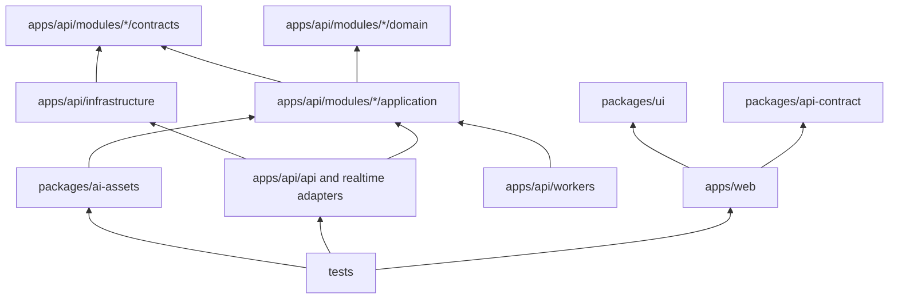

# Verity Monorepo Folder Structure

| Document control | Detail |
| --- | --- |
| Status | Proposed repository layout |
| Architecture alignment | Modular monolith, typed API contract, independently runnable API/worker/realtime processes |
| Rule | Folder ownership is a design boundary, not an excuse for circular imports or duplicated domain logic |

## 1. Repository hierarchy

```text
verity/
├── apps/
│   ├── web/                         # Next.js candidate, share, and admin web experience
│   │   ├── app/                     # Routes, layouts, server composition, metadata
│   │   ├── components/              # Feature-local UI composed from packages/ui
│   │   ├── features/                # Profile, blueprint, session, report, privacy flows
│   │   ├── hooks/                   # Browser-only interaction hooks
│   │   ├── lib/                     # API client setup, auth-safe utilities, formatting
│   │   ├── styles/                  # Tailwind entry point and design tokens
│   │   ├── public/                  # Non-sensitive static assets only
│   │   └── tests/                   # Component and web integration tests
│   │
│   └── api/                         # FastAPI modular-monolith application
│       ├── src/verity/
│       │   ├── api/                 # HTTP/WebSocket adapters and versioned route assembly
│       │   ├── core/                # Settings, security primitives, errors, dependencies
│       │   ├── db/                  # Engine/session setup, Alembic integration, base types
│       │   ├── modules/             # Bounded business modules; see section 2
│       │   ├── infrastructure/      # Provider adapters: storage, queue, AI, OAuth, telemetry
│       │   ├── workers/             # Worker and scheduler process entry points
│       │   └── main/                # API/realtime process entry points and composition root
│       ├── migrations/              # Alembic revision history and migration support
│       ├── tests/                   # Python unit, integration, contract, and policy tests
│       └── pyproject.toml           # Python dependency/tool configuration
│
├── packages/
│   ├── api-contract/                # OpenAPI source artifacts, generated client boundary, schemas
│   ├── ui/                          # Shared shadcn/ui wrappers, accessibility primitives, tokens
│   ├── ai-assets/                   # Versioned prompts, rubric catalogs, output schemas, evaluator cards, fixtures
│   ├── config/                      # Shared lint/format/type/test configuration
│   └── observability/               # Event names, redaction policy, telemetry conventions
│
├── tests/
│   ├── e2e/                         # Cross-app candidate journeys and accessibility checks
│   ├── contract/                    # Consumer/provider API contract tests
│   ├── evaluation/                  # Golden sets, human labels, release-gate metrics
│   ├── load/                        # Synthetic API/realtime/worker load scenarios
│   └── fixtures/                    # Synthetic or expressly consented, de-identified test assets
│
├── infra/
│   ├── docker/                      # Production Dockerfiles and Compose support
│   ├── railway/                     # Railway process/deployment metadata
│   ├── vercel/                      # Vercel configuration and preview constraints
│   ├── monitoring/                  # Dashboard, alert, and tracing configuration
│   └── scripts/                     # Safe operational and CI helper scripts
│
├── docs/
│   ├── PRD.md
│   ├── Architecture.md
│   ├── Database.md
│   ├── API.md
│   ├── TechStack.md
│   ├── FolderStructure.md
│   ├── adr/                         # Architecture decision records
│   ├── runbooks/                    # Provider outage, dead-letter, rollback, deletion, and restore procedures
│   ├── security/                    # Threat model, data map/classification, retention, vendor review
│   └── evaluation/                  # Evaluator card, benchmark governance, release-gate history
│
├── .github/
│   ├── workflows/                   # CI, preview, deployment, evaluator gates
│   ├── dependabot.yml
│   └── pull_request_template.md
│
├── docker-compose.yml               # Local integration topology only
├── README.md                        # Setup, product boundary, local development, contribution guide
├── package.json                     # JavaScript workspace orchestration
├── pnpm-workspace.yaml              # Frontend/package workspace declaration
└── .gitignore
```

The repository contains both TypeScript and Python, but it remains one product repository with a shared review, release, contract, documentation, and security posture. A JavaScript workspace manager governs the web/shared packages; Python dependencies stay isolated in the API application. This avoids forcing Python into a Node package model while retaining coordinated CI.

## 2. Backend module ownership

```text
modules/
├── identity/        # Users, OAuth identities, sessions, RBAC
├── privacy/         # Consent, retention, exports, deletion, redaction
├── profile/         # Candidate profile, documents, parsing, approved facts
├── blueprint/       # Job targets, source citations, competency blueprint, rubric selection
├── rubric/          # Rubric catalog/version publication and validation
├── interview/       # Session state machine, turns, timer, adaptive follow-up commands
├── transcript/      # Media lifecycle, transcription versions, segments, delivery observations
├── evaluation/      # Evidence extraction, verification, claims, reports, challenge/re-evaluation
├── learning/        # Drills, comparable re-tests, progress views
├── sharing/         # Redacted report projections and expiring share links
└── operations/      # Idempotency, outbox, jobs, audit, quota, operational health
```

Each module has the same internal shape where it needs it:

```text
<module>/
├── domain/          # Entities, value objects, invariants, domain events
├── application/     # Use cases, commands/queries, transaction boundaries, policies
├── adapters/        # REST/WebSocket presentation and repository/provider implementations
├── contracts/       # Typed module-facing DTOs/events; no persistence internals
└── tests/           # Module unit and integration tests
```

Not every module must create every directory on day one. The shape preserves dependencies: route handlers call application services; application services depend on contracts/ports; adapters implement ports; domain logic does not import FastAPI, SQLAlchemy, LangChain, or a provider SDK.

## 3. Dependency rules



Rules that maintain the architecture:

- The web app consumes only the published API contract, never database schema, prompt internals, or Python implementation details.
- The API owns OpenAPI generation. Generated TypeScript output is a client artifact, not a second API specification maintained by hand.
- Shared UI contains visual/accessibility primitives only. Product features stay in the web app; backend policy does not migrate into UI packages.
- AI prompt and rubric assets are versioned, reviewed data. Application code loads them through a registry that records the selected version; prompts do not live inside route handlers.
- All candidate-provided text reaches an AI adapter through a source-classification boundary. Prompts may consume the adapter's labeled, bounded input projection, never an arbitrary request body or a route-handler string.
- A module communicates with another module through an application contract/event, not by importing its repository or directly updating its tables.
- Infrastructure adapters may depend on vendor SDKs. Domain/application folders may depend only on defined ports/contracts.
- Test fixtures may not contain real resumes, audio, OAuth tokens, or production exports unless explicitly consented, de-identified, access-restricted, and retention-managed.

## 4. API and frontend organization

The Next.js app groups routes by user journey: onboarding/profile, blueprint, interview session, report/evidence graph, learning plan, privacy settings, and scoped share page. A feature owns its page composition, feature-specific components, state, and tests; generic buttons, dialogs, form primitives, and accessibility helpers belong in packages/ui.

FastAPI route assembly is versioned under api/v1 and organized by resource, but route handlers remain thin. Authentication, authorization, idempotency, request validation, and response mapping happen at the adapter boundary. Each handler invokes a single application use case. WebSocket event definitions sit beside the interview/realtime contract and use the same application services so REST and realtime paths cannot diverge on session state.

## 5. AI assets and evaluator quality

The ai-assets package contains:

- Prompt templates identified by immutable version.
- JSON-schema/Pydantic-compatible structured-output definitions.
- Published rubric catalogs with observable descriptors and prohibited inferences.
- Redaction fixtures and synthetic transcript examples.
- Consented, de-identified golden evaluation sets with human labels.
- Evaluator-card metadata for benchmark provenance, slice minimums, confidence intervals, release owners, and rollback criteria.
- Release-gate configuration for citation validity, agreement, fairness, harmfulness, prompt-injection resistance, and regression thresholds.

It must not contain customer data, secrets, hidden real-interview questions, or unreviewed prompt experiments. New assets require peer review, a changelog entry, evaluator test results, and a rollout/rollback plan. Production uses a selected immutable asset version, not whichever file happens to be on a branch.

## 6. Infrastructure and documentation boundaries

The infra directory holds declarative deployment, container, monitoring, and safe operational support. It does not hold application business logic or plaintext production credentials. Docker Compose is for local development and CI integration; Vercel/Railway configuration is environment-specific and uses platform-managed secrets.

Documentation remains close to the repository because architecture, API contracts, threats, runbooks, and ADRs must evolve with code. Before beta, `docs/security` must contain the threat model, data-flow/classification map, retention/deletion matrix, and vendor-review records; `docs/runbooks` must cover provider outage, dead-letter replay, security incident, model rollback, deletion/export failure, and restore exercise; `docs/evaluation` must contain the active evaluator card and release-gate evidence. An ADR records a decision, alternatives, consequences, owner, and review trigger. A runbook is executable operational guidance for an incident or lifecycle task; it is not a substitute for automated tests.

## 7. Repository acceptance checklist

- A new contributor can locate the frontend feature, API use case, domain policy, provider adapter, migration, contract, test, and operational documentation without a global search.
- No business module depends directly on a third-party AI/storage/queue SDK.
- No web package depends on Python internals or bypasses the versioned API contract.
- Prompt/rubric versions and golden-set tests are reviewed alongside their associated evaluator changes.
- Candidate-provided content can reach a provider only through the source-classification/redaction adapter, and evaluator assets define measurable prompt-injection resistance.
- Infrastructure, tests, documentation, and CI are first-class root areas, not hidden under an application folder.
