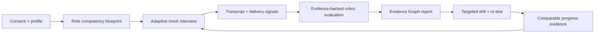

# PRD — Verity: Evidence-Driven AI Interview Coach

| Document control | Detail |
| --- | --- |
| Status | Proposed MVP |
| Product type | Web application with voice-first interview simulations |
| Primary users | Software-engineering and AI/ML candidates |
| Product owner | Portfolio project owner |
| Version | 1.0 — 14 July 2026 |

## Executive summary

**Verity** is an ethical, evidence-driven AI Interview Coach for candidates preparing for SDE, system-design, and AI/ML interviews. It runs realistic, adaptive voice interviews from a candidate's resume and a target job description, then produces an **Interview Evidence Graph**: every score is linked to specific moments in the transcript, an explicit rubric criterion, and a prescribed drill. It learns which competency is improving, which remains weak, and schedules the next highest-leverage practice session.

The product deliberately does **not** provide hidden, real-time answers during a live interview. Its purpose is skill-building before interviews, with clear consent, privacy controls, and explainable assessment. This choice is both ethically defensible and a stronger engineering story than a generic chat wrapper: it requires multimodal analysis, traceable LLM evaluation, adaptive planning, measurable learning outcomes, and trustworthy systems design.

## 1. Project vision

### Vision statement

Help every technical candidate turn interview practice into measurable, explainable improvement—so they can communicate what they genuinely know with clarity and confidence.

### Product principles

1. **Practice, never deception.** The coach is unavailable as a stealth answer generator for active interviews; it provides preparation and post-session reflection only.
2. **Evidence before score.** A number without supporting transcript evidence, rubric criteria, and uncertainty is not useful feedback.
3. **Role-specific, not generic.** Questions and feedback are grounded in the job description, candidate profile, selected interview type, and competency model.
4. **Deliberate practice over endless mocks.** The system diagnoses a small number of root weaknesses and assigns drills that can be repeated and compared.
5. **Human agency and privacy.** Candidates own their recordings, can correct the coach, export their data, and delete it permanently.
6. **Fairness is a product feature.** Communication quality is evaluated separately from accent, identity, or socioeconomic signals; the user can challenge feedback.

### Strategic product wedge

The core wedge is the **Interview Evidence Graph (IEG)**. Instead of a one-off overall score, Verity models:

`Role requirement → competency → rubric criterion → question → answer span → evaluator claim → confidence → drill → later evidence`

For example, a low *system-design trade-off* rating must cite the answer span where scale, latency, or consistency was omitted, name the rubric criterion, explain the evaluation confidence, and assign a five-minute trade-off drill. A later answer can demonstrate improvement against the same criterion. This creates an auditable learning loop and a compelling, AI-engineering-centric GitHub showcase.

## 2. Target audience

### Primary market

Early-career through mid-level candidates applying for:

- SDE / backend / full-stack / platform engineering roles
- Machine-learning, data-science, applied-AI, and MLOps roles
- Technical product roles with a system-design or technical-depth component

The initial launch should focus on English-language remote interview preparation for candidates pursuing roles at product companies, startups, and global-service firms. The system is designed to be usable from India and other global markets, where repeated paid human mocks may be inaccessible.

### Secondary market

- Career-switchers who need structured technical storytelling.
- University career centers and bootcamps that need privacy-safe cohort analytics.
- Mentors who want evidence-backed artifacts to make a short coaching session more effective.

### Explicit non-targets for MVP

- Candidates seeking covert assistance in a live interview.
- Full coding-editor replacement or a platform for judged algorithmic challenges.
- Hiring teams using the product to decide who to employ.

## 3. Problem statement

Technical candidates face four linked problems:

1. **Preparation is fragmented.** Resumes, job descriptions, question lists, mock platforms, and generic AI chat are disconnected.
2. **Practice feedback is vague or inconsistent.** “Be more concise” does not identify which sentence, competency, or behavior needs correction.
3. **Mock interviews are static.** Prepared answers can look strong until an interviewer asks a follow-up that tests depth, constraints, or trade-offs.
4. **Progress is invisible.** Candidates repeat mocks without knowing whether they have improved in the skills that matter for their next role.

For AI/ML and SDE candidates, this is amplified by technical interviews that assess reasoning aloud: requirements discovery, algorithmic justification, architectural trade-offs, ML experimentation, safety, and communication under time pressure.

## 4. Value proposition

### Candidate promise

> Practice the interview you are likely to face, see exactly why an answer worked or failed, and know the single best thing to rehearse next.

### Distinguishing benefits

| Benefit | How Verity delivers it |
| --- | --- |
| Relevant practice | Builds a competency blueprint from the resume, job description, level, and interview track. |
| Real interviewer pressure | Uses time limits, adaptive follow-ups, interruptions, and a configurable interviewer persona. |
| Defensible feedback | Anchors each claim to transcript timestamps, a transparent rubric, and calibrated evaluator confidence. |
| Faster improvement | Converts weaknesses into short, repeatable drills and schedules spaced re-tests. |
| Trustworthy coaching | Separates content quality from delivery metrics, shows uncertainty, enables corrections, and protects candidate data. |
| Portfolio-grade depth | Demonstrates retrieval, speech, orchestration, structured LLM outputs, evaluation, observability, and responsible-AI design. |

## 5. Competitive analysis

The current category has three broad patterns: human/AI mock platforms, voice practice products, and real-time “copilots.” Interviewing.io combines AI and human mock interviews for technical subjects; Final Round AI markets a resume-aware mock interview plus post-interview reports, but also prominently markets invisible assistance during active interviews. Rehearse similarly offers resume/job-post personalization, voice rounds, feedback, and progress history. These validate demand for personalized voice practice and post-session feedback, but leave space for a transparent, skill-building product centered on traceability and longitudinal learning.

| Alternative | Strengths | Gap Verity targets |
| --- | --- | --- |
| **Interviewing.io** | Experienced human interviewers; technical coding, design, ML, and behavioral mock coverage; AI practice option. | Human coaching can be costly and feedback is not a continuously maintained, criterion-level learning model. |
| **Final Round AI** | Job-description/resume personalization, mock interviews, transcripts, speech feedback, and broad interview support. | Positions live, stealth assistance as a flagship. Verity takes a preparation-only, explainable, integrity-first approach. |
| **Rehearse** | Voice-based personalized rounds, interviewer styles, difficulty modes, per-question scoring, confidence tracking. | The opportunity is an auditable connection between score, answer evidence, competency, and targeted re-test. |
| **Generic LLM chat / question banks** | Low friction and broad knowledge. | No realistic dialog, consistent rubric, verified evidence, or longitudinal skill plan. |
| **Human mentor / peer mock** | Empathy, domain judgment, accountability. | Hard to schedule, expensive, and difficult to quantify over time; Verity supplies a reusable coaching artifact rather than replacing the mentor. |

### Positioning statement

For technical candidates who want to improve—not merely generate answers—Verity is the interview-practice coach that makes every assessment traceable to evidence and turns it into an adaptive practice plan. Unlike opaque mock-interview scorers or live-answer copilots, Verity develops authentic capability through transparent, privacy-first rehearsal.

### Market evidence and sources

- [Interviewing.io](https://interviewing.io/) describes anonymous human mock interviews and an AI interviewer across coding, system design, ML, and behavioral practice.
- [Final Round AI](https://www.finalroundai.com/) describes tailored mock interviews, transcript-based reports, speech insights, and real-time “stealth” interview assistance.
- [Rehearse listing](https://play.google.com/store/apps/details?hl=pt&id=com.lnguyen503.rehearseinterview) describes resume/job-post-tailored voice rounds, feedback, and progress trends.

Competitor capabilities should be revalidated before a public launch; this analysis reflects public product information accessed on 14 July 2026.

## 6. User personas

### 1. Asha — final-year CS student

- **Context:** Applying for entry-level SDE and AI internships; strong coursework but little interview experience.
- **Goal:** Practice speaking through algorithms and projects without relying on memorized scripts.
- **Pain points:** Anxiety, difficulty structuring STAR stories, and no reliable peer to mock with regularly.
- **Success:** Can show a consistent upward trend in “clarifies requirements,” “explains complexity,” and “communicates trade-offs.”

### 2. Ravi — backend engineer changing companies

- **Context:** Three years of experience; applying for SDE II/backend roles while working full time.
- **Goal:** Target limited preparation time at system design and impact stories relevant to each role.
- **Pain points:** Generic question lists and vague feedback fail to identify what to fix before a scheduled loop.
- **Success:** Completes a role-specific, evidence-backed plan in short sessions and can defend design decisions under follow-up questions.

### 3. Maya — applied-ML candidate

- **Context:** Has models and projects, but interviews test experimental design, evaluation, deployment, and responsible AI.
- **Goal:** Translate technical work into clear, high-signal narratives for ML engineering interviews.
- **Pain points:** Generic interview apps undervalue data quality, metric choice, offline/online evaluation, monitoring, and safety.
- **Success:** Answers follow-ups about failure modes, data leakage, model selection, and monitoring with concrete, role-appropriate reasoning.

### 4. Daniel — volunteer mentor / career coach

- **Context:** Gives occasional pro-bono mocks to technical candidates.
- **Goal:** Spend live time on judgment and nuance rather than recapping a recording.
- **Pain points:** No shared, concise record of the candidate's precise weaknesses and improvements.
- **Success:** Receives a candidate-approved, redacted evidence report that makes a 30-minute human session more valuable.

## 7. User stories

| ID | User story | Acceptance signal |
| --- | --- | --- |
| US-01 | As a candidate, I want to upload/paste my resume and a job description so that practice reflects my target role. | The system presents an editable competency blueprint with source citations to the supplied documents. |
| US-02 | As a candidate, I want to select SDE, system design, behavioral, or ML interview modes so that questions use the relevant rubric. | The generated plan and report use the selected track's competencies. |
| US-03 | As a candidate, I want a voice mock with natural follow-up questions so that I cannot succeed by rehearsing a static script. | At least one follow-up is grounded in a claim, omission, or ambiguity in my answer. |
| US-04 | As a candidate, I want to pause, skip, or type an answer so that accessibility and unstable connections do not block practice. | Sessions preserve state and label non-voice answers appropriately. |
| US-05 | As a candidate, I want every feedback item linked to an exact transcript moment and rubric criterion so that I know what to improve. | Clicking a claim opens the cited excerpt/timestamp and evaluation rationale. |
| US-06 | As a candidate, I want to challenge an incorrect assessment so that the coach can capture disagreement and improve trust. | I can mark feedback “helpful,” “incorrect,” or “needs context,” add a note, and request re-evaluation. |
| US-07 | As a candidate, I want a short drill and later re-test for my weak competency so that I can verify improvement. | The dashboard creates a drill, due date, and comparable rubric view. |
| US-08 | As a candidate, I want to control recording retention and delete/export my data so that sensitive career information stays mine. | Account settings support consent, export, deletion, and configurable retention. |
| US-09 | As a mentor, I want a candidate-approved share link with redaction options so that I can review evidence efficiently. | The link is scoped, revocable, and omits raw media by default. |

## 8. Functional requirements

### FR-1: Onboarding and candidate profile

- The system shall require explicit consent before processing a resume, job description, audio, or video.
- The system shall accept pasted text and common resume formats; it shall extract structured profile facts while preserving the original source.
- The candidate shall be able to edit, delete, or mark extracted facts as inaccurate before they affect question generation.
- The system shall let the candidate create a target role with its experience level, interview type, and target date; profile preferences such as language, accessibility, and feedback directness remain independent of a specific target.

### FR-2: Role and competency blueprint

- The system shall create an editable blueprint that maps role requirements to an interview track and competency rubric.
- Initial tracks shall be behavioral, coding-reasoning, system design, and ML/AI. Each rubric shall use 4–6 observable competencies and four ordered proficiency levels.
- The blueprint shall cite supplied resume/job-description excerpts for personalization claims, and distinguish user-supplied facts from model inferences.
- The system shall allow a candidate to remove sensitive topics or add a specific project to practice.

### FR-3: Interview simulation

- The system shall run 5-, 15-, 30-, and 45-minute mock sessions using text and voice input; voice is the primary MVP experience.
- The interviewer shall state the format, ask one question at a time, maintain session context, and ask adaptive follow-ups based on the candidate's answer.
- The system shall support configurable interviewer styles (supportive, neutral, challenging) without changing the rubric standard.
- The interviewer shall never imply it is a real employer or evaluate protected characteristics.
- The system shall show a timer, pause/stop control, transcript-in-progress indicator, and clear recording status.
- The coding-reasoning track shall assess explanation, complexity, edge cases, and test strategy; it will not execute untrusted code in MVP.

### FR-4: Speech, transcript, and delivery analysis

- The system shall generate a time-aligned transcript, label it as machine-generated, and allow the candidate to correct meaningful errors.
- It shall measure delivery signals such as answer duration, long pauses, filler density, speaking-rate range, and interruption/recovery patterns.
- It shall explicitly avoid scoring accent, dialect, voice pitch, gender presentation, or inferred emotion/personality.
- Delivery signals shall be presented as optional coaching observations, not as hiring predictions or an aggregate “employability” score.

### FR-5: Evidence-backed evaluation

- The system shall evaluate each answer against a versioned rubric using structured outputs validated against a schema.
- Every evaluative claim must contain: competency, criterion, score band, one or more transcript spans, explanation, confidence, and a suggested improvement.
- The report shall display separate **content**, **reasoning**, **structure**, and **delivery** views; no single unqualified “hire score” may be shown.
- If the evaluator cannot cite adequate evidence or has low confidence, it shall abstain or request manual/user clarification rather than invent a critique.
- The candidate shall be able to view a concise report first and expand into full evidence, prompts/rubric version, and transcript context.

### FR-6: Interview Evidence Graph and learning plan

- The system shall persist relationships among session, question, answer span, rubric criterion, feedback claim, drill, and re-test.
- It shall identify up to three highest-leverage next actions, based on competency importance, evidence strength, target-date urgency, and prior performance.
- The system shall schedule spaced re-tests and show trend changes only when comparable rubric criteria and sufficient evidence exist.
- It shall distinguish “not yet assessed,” “insufficient evidence,” and “declined” from poor performance.

### FR-7: Feedback interaction and sharing

- Users shall be able to replay/click cited answer spans, rate feedback, flag inaccuracies, and request a limited re-evaluation with added context.
- Users shall be able to generate a private, expiring share link for a selected report. Raw recordings must be opt-in and disabled by default.
- All feedback and re-evaluation events shall be retained as audit metadata, visible to the candidate.

### FR-8: Data controls and administration

- The product shall provide in-product export and deletion requests, consent/retention settings, account deletion, and clear explanations of data use.
- The product shall implement role-based access controls for support/admin functions and audit all privileged data access.
- The product shall surface health/status information and a safe fallback if an AI provider is unavailable.

## 9. Non-functional requirements

| Area | Requirement / target |
| --- | --- |
| Performance | For a 15-minute session, generate the initial transcript increment within 5 seconds in 90% of supported conditions; generate the final report within 90 seconds in p90 after session completion. Track separately by provider and audio length. |
| Availability | Target 99.5% monthly availability for core sessions after MVP beta; degrade to transcript saving and later evaluation when generation services fail. |
| Reliability | Audio uploads, interview events, and evaluation jobs must be idempotent. A retry must not create duplicate sessions, charges, or reports. |
| Scalability | Support asynchronous media/evaluation workloads and stateless API instances; design for at least 100 concurrent beta sessions without architectural change. |
| Security | Encrypt data in transit and at rest, protect secrets in a managed vault, implement least-privilege RBAC, signed uploads, rate limits, dependency scanning, and audit logs. |
| Privacy | Collect the minimum necessary data, use purpose limitation, default to short raw-audio retention, support export/deletion, and do not train models on candidate data without separate opt-in consent. |
| Recovery | Before beta, define and exercise recovery objectives for the system of record and object storage. Deletion, retention, and customer messaging must state the backup-expiry window rather than imply immediate erasure from backups. |
| Accessibility | Meet WCAG 2.2 AA for the web experience; provide captions/transcript, keyboard operation, visible focus, text-only mode, adjustable timer, and reduced-motion support. |
| Fairness | Test evaluation consistency across accents, dialects, genders, and native/non-native English speakers; do not use protected traits or proxy delivery signals in content scoring. |
| Explainability | At least 95% of shown evaluative claims must include valid evidence and rubric references. Claims without evidence must be suppressed. |
| Observability | Use correlation IDs, structured logs, distributed traces, model/prompt/rubric versioning, latency/cost/error dashboards, and redacted debugging data. |
| Maintainability | Use modular boundaries, API contracts, schema validation, migrations, automated tests, and architecture decision records (ADRs). |
| Cost control | Enforce per-user usage budgets, audio-duration limits, queue back-pressure, evaluation caching where safe, and cost telemetry per completed session. |
| Localization readiness | Externalize UI strings; retain original-language transcript and evaluation metadata. English is MVP, not an English-only architecture. |

## 10. Core MVP features

The MVP should prove the complete learning loop for a narrow, high-signal scope—not attempt every interview format.

### MVP scope

1. Candidate onboarding with text resume/job-description intake, consent, and editable profile.
2. Two interview tracks: **behavioral** and **system design** for SDE/AI/ML candidates.
3. A 5–15 minute voice-first or text-accessible mock interview with adaptive follow-ups.
4. Time-aligned transcript with basic, non-judgmental delivery observations.
5. Versioned competency rubrics and evidence-backed feedback report.
6. Interview Evidence Graph viewer: claim → transcript excerpt → criterion → drill.
7. Three personalized practice drills and one comparable re-test recommendation.
8. Session history, competency trends, feedback challenge controls, export/delete controls.
9. Product telemetry, tracing, cost monitoring, and an evaluator-quality test set.

### Explicit MVP exclusions

- Live-interview copilot, stealth overlay, or answer suggestions during an actual interview.
- Webcam-based emotion, eye-contact, attractiveness, or body-language scoring.
- Automated employment recommendations, “hire/no hire” labels, or recruiter-facing ranking.
- Production code execution, company-specific leaked-question databases, payments, and native mobile apps.
- Full multilingual scoring; ensure the data model makes it possible later.

### MVP experience flow

## 11. Future features

### Post-MVP (validated extensions)

- **Coding workspace:** Sandboxed editor, test cases, solution snapshots, and explanation-vs-code alignment analysis.
- **ML interview lab:** Case simulations for experimentation, data quality, model evaluation, deployment, monitoring, incident response, and responsible AI.
- **System-design canvas:** Collaborative architecture diagramming with constraint cards, calculator, and evidence-grounded design critique.
- **RAG-grounded company research:** Candidate-supplied or licensed public sources, citations, freshness markers, and strict separation from confidential/leaked content.
- **Multi-language practice:** Native-language UI, bilingual transcripts, and evaluation validated for each supported language rather than direct translation assumptions.
- **Human-coach handoff:** Candidate-consented report sharing, coach annotation, and rubric calibration—not automated replacement of human judgment.
- **Cohort mode:** Privacy-preserving, aggregated skill trends for universities/bootcamps; never expose individual recordings by default.
- **Experimentation engine:** Compare drill types and interviewer styles with consented, anonymized outcomes to optimize learning.
- **Calendar-integrated prep plan:** Target-date-aware practice schedule and reminders.

### Advanced differentiators

- **Counterfactual coaching:** Show how a candidate could improve one criterion while preserving their authentic experience, clearly labeled as an example—not a script to memorize.
- **Calibration ledger:** Track evaluator agreement with candidate challenges, expert review, and repeat-session consistency by rubric/model version.
- **Confidence-aware progress:** Display trends with evidence volume and uncertainty rather than implying precision from one short answer.
- **Privacy-preserving local mode:** Perform recording/transcription on-device where feasible; upload only candidate-approved text/evaluation data.

## 12. Technical constraints

### Architecture and platform constraints

- Build as a responsive web application first; use a secure backend API, relational database, object storage, asynchronous job queue, and real-time session transport.
- Treat audio, transcripts, rubric definitions, answer evidence, and derived reports as distinct data classes with separate retention policies.
- Use provider-agnostic interfaces for speech-to-text, text-to-speech, and LLM evaluation so that vendors can be changed or workloads routed by quality/cost.
- LLM interactions must require structured, schema-validated output; use deterministic validation/retry behavior and persist model, prompt, and rubric versions.
- Treat resumes, job descriptions, transcript text, corrections, and challenge notes as untrusted data, never as instructions. AI workflows must delimit them by source, deny tool/action requests from their contents, and validate outputs against product policy before any state change or display.
- Do not place raw resumes, audio, or complete transcripts in application logs, analytics events, or unredacted error traces.
- All untrusted file uploads and future code execution require malware scanning, quotas, isolation, and no credentials/network access from a sandbox.

### AI quality constraints

- Generated questions must be traceable to a selected rubric and relevant candidate/job evidence; unsupported claims about a candidate's experience are prohibited.
- Evaluation prompts may critique communication and reasoning but must not infer personality, truthfulness, mental state, socioeconomic status, or protected traits.
- Evidence extraction must occur before final critique generation; the final evaluator can only cite transcript spans that exist in the evidence store.
- Use a curated, consented benchmark set spanning behavioral, system-design, and ML responses; measure grounding, rubric agreement, harmfulness, and fairness before any model/prompt release.
- Define the benchmark's cohort-slice minimum sample sizes, confidence intervals, and release/rollback rules in an evaluator card. A fairness gap from an underpowered slice is inconclusive, not a pass.
- Human review is required for benchmark labeling, rubric changes, and high-severity feedback issues; the LLM is a coach, not an authority.

### Legal, ethical, and operational constraints

- Obtain affirmative, granular consent for recording and processing; disclose model/provider use and retention in plain language.
- Make deletion and export operationally real across primary storage, derived artifacts, caches, and configured backup lifecycle (subject to stated legal/operational windows).
- Do not claim users will receive a job or can predict hiring decisions.
- Respect document licenses, company terms, and intellectual-property boundaries; do not solicit or distribute confidential interview questions.
- Before commercial or institutional rollout, obtain legal/privacy review for applicable jurisdictions and conduct a security assessment. The PRD is not legal advice.

## 13. Success metrics

Metrics must demonstrate authentic improvement, trust, and quality—not merely time spent or inflated model scores.

| Objective | Metric | MVP target / decision threshold |
| --- | --- | --- |
| Activation | % of new users completing profile, blueprint, and first 5+ minute session within 24 hours | ≥ 45% in beta |
| Learning loop | % of completed sessions leading to at least one drill completion within 7 days | ≥ 35% |
| Retention | Week-2 retained users among activated users | ≥ 25% |
| Perceived usefulness | Post-report “feedback was specific and actionable” rating (4 or 5 / 5) | ≥ 75% |
| Trust | % of shown feedback claims marked incorrect by users | < 12%; investigate any rubric/model cohort > 15% |
| Grounding | Valid evidence/rubric attachment rate for displayed claims | ≥ 95%, target 100% |
| Adaptive quality | % of session follow-ups judged relevant to prior answer in expert sample | ≥ 80% |
| Improvement | Median change in comparable rubric score after ≥2 sessions, accompanied by evidence volume | Positive directional improvement; never use as a hiring-probability claim |
| Fairness | Worst-group versus overall evaluator agreement gap on benchmark slices | ≤ 8 percentage points, otherwise block release/roll back |
| Reliability | Completed sessions with a usable report | ≥ 95% during beta |
| Latency | p90 final-report processing time for 15-minute sessions | ≤ 90 seconds |
| Unit economics | AI/media cost per completed 15-minute session | Set a beta budget; instrument from day one and enforce limits |

### Evaluation plan

Use a blinded, rubric-labeled test set before release. For each release, compare evaluator feedback with trained human reviewers on citation validity, score agreement, helpfulness, harmfulness, and fairness slices. Run regression tests on prompt/rubric/model changes. Collect candidate feedback, but do not use satisfaction alone as evidence of correctness.

## 14. Development milestones

| Milestone | Outcome | Exit criteria |
| --- | --- | --- |
| **M0 — Discovery and safety design** (Weeks 1–2) | Define candidate journey, scope, ethical boundary, rubric taxonomy, data map, threat model, and evaluator card. | PRD, user-flow prototype, consent/retention design, ADRs, slice-aware evaluation plan, and 20–30 labeled evaluation examples approved. |
| **M1 — Foundation** (Weeks 3–4) | Establish authenticated app shell, profile/document intake, data model, observability, and secure media pipeline. | Resume/JD ingestion works on test corpus; audit logs, deletion flow design, CI checks, and baseline telemetry are in place. |
| **M2 — Interview vertical slice** (Weeks 5–6) | Deliver one behavioral mock from question generation through transcript and report. | 5–15 minute session completes end-to-end; interviewer state persists; failure/retry path is tested. |
| **M3 — Evidence Graph and rubric evaluation** (Weeks 7–8) | Add structured, grounded evaluation and drill plan. | ≥95% claim evidence attachment on benchmark; claims are schema-valid; report viewer can trace claim to source span. |
| **M4 — SDE/AI differentiation** (Weeks 9–10) | Add system-design track, adaptive follow-ups, competency trends, and re-test flow. | Expert review says ≥80% follow-ups are relevant; comparable-session trend view and drill completion loop work. |
| **M5 — Trust, accessibility, and beta hardening** (Weeks 11–12) | Make the product safe and usable for a closed beta. | Accessibility audit, privacy/security review, rate limiting, load test, model regression suite, and user feedback challenge path complete. |
| **M6 — Portfolio launch** (Weeks 13–14) | Publish a polished demo and engineering narrative. | Architecture diagram, demo video, anonymized evaluation results, ADRs, threat model, and setup/docs are review-ready; no private candidate data included. |

The dates are planning assumptions, not commitments. A solo developer should prioritize vertical-slice quality and evaluator testing over feature breadth.

## 15. Risks and mitigation strategies

| Risk | Likelihood / impact | Mitigation | Leading indicator |
| --- | --- | --- | --- |
| Hallucinated or unsupported feedback | Medium / High | Evidence-first pipeline, schema validation, citation verifier, low-confidence abstention, evaluator regression suite, user challenge control. | Citation-validity rate falls or “incorrect” feedback rises. |
| Biased scoring of accent or communication style | Medium / High | Do not score accent/protected-trait proxies; isolate delivery from content; benchmark across speech varieties; expert audit and release gates. | Group disagreement gap exceeds threshold. |
| Users attempt to use it for real-time cheating | Medium / High | Product policy, session-only interaction design, no stealth mode/overlays, explicit integrity messaging, abuse monitoring. | Requests/tickets mentioning live interview assistance. |
| Sensitive resume/audio exposure | Low–Medium / Critical | Data minimization, encryption, short retention, least privilege, redacted logs, deletion/export testing, vendor review, incident plan. | Unusual privileged access, secret scan alerts, failed deletion jobs. |
| AI cost or latency becomes unsustainable | High / Medium | Model routing, duration limits, async jobs, usage quotas, caching only safe derived artifacts, cost telemetry. | Cost/session or p90 report latency exceeds budget. |
| Generic questions make the product feel like a chatbot | Medium / High | Blueprint grounding, adaptive follow-ups, professional rubric review, relevance evaluation set. | Low relevance ratings; low follow-up expert score. |
| Users over-trust scores or become discouraged | Medium / High | Avoid hiring predictions, display uncertainty/evidence, strengths plus next action, copy review, user challenge path. | Reports repeatedly interpreted as “hire score”; negative qualitative feedback. |
| Speech transcription errors degrade coaching | Medium / Medium | User-editable transcript, confidence flags, supported-audio guidance, provider evaluation, text fallback. | Transcript correction rate or error reports rise. |
| Evaluation drift after model/provider changes | Medium / High | Version everything, golden set, canary release, rollback, calibration ledger. | Benchmark regression or changed outcome distribution. |
| Scope creep delays a compelling launch | High / High | Lock MVP exclusions, maintain a feature decision log, ship one vertical slice before additional tracks. | Milestone work lacks an end-to-end demo by Week 6. |
| Lack of credible outcome evidence | Medium / Medium | Instrument learning loop, recruit a small consented beta, use blinded human rubric reviews, report limitations honestly. | Insufficient re-tests or low drill completion. |

## Appendix A — Initial competency rubrics

### Behavioral

- **Narrative structure:** Context, responsibility, actions, and outcome are comprehensible and proportionate.
- **Ownership and impact:** Candidate distinguishes personal contribution, decisions, and measurable results.
- **Reflection:** Candidate explains learning, trade-offs, and what would change next time.
- **Follow-up depth:** Candidate supports claims with concrete examples under probing.

### System design

- **Requirements and constraints:** Clarifies functional/non-functional requirements and scopes the solution.
- **Architecture:** Proposes coherent components, data flow, interfaces, and failure boundaries.
- **Trade-off reasoning:** Relates choices to scale, latency, reliability, consistency, cost, security, and operations.
- **Evolution and validation:** Describes bottlenecks, observability, testing, rollout, and an iterative path.

### ML/AI (future rubric, usable for question planning)

- **Problem framing and data:** Defines objective, labels, data quality risks, leakage, and splits.
- **Experimentation and evaluation:** Selects metrics/baselines, analyzes error, and explains offline/online validation.
- **Model and system trade-offs:** Justifies model choice, latency/cost, reliability, and deployment design.
- **Safety and monitoring:** Covers fairness, privacy, robustness, drift, alerting, and rollback.

Each criterion must be associated with observable evidence, a four-level descriptor, prohibited inferences, and examples of appropriate feedback before it is activated in the product.

## Appendix B — Resume-ready project narrative

> Designed an evidence-driven AI Interview Coach for SDE and AI/ML candidates, featuring adaptive voice mocks, transcript-grounded rubric evaluation, and an Interview Evidence Graph linking feedback to answer evidence and targeted drills. Built the product specification around privacy-by-design, fairness testing, versioned LLM evaluation, and measurable learning outcomes.

When implementation begins, substantiate this claim with an architecture diagram, benchmark results, ADRs, a threat model, accessible UI, end-to-end tests, and a short anonymized demo—not feature count alone.
